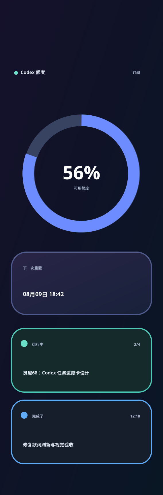

# REQ-002 详细设计



## 1. 142×428 布局

额度页任务卡是 `AiQuotaTheme` 的一部分，独立主题是 `CodexTasksTheme`；两者均不是桌面窗口控件。所有位置相对 `ScreenCanvas.SafeBounds` 计算，避免覆盖键盘固件的顶部状态区。

| 区域 | 相对安全区位置 | 内容 |
| --- | --- | --- |
| 顶部 | `y=4..20` | `Codex 额度` |
| 圆环 | 中心 `y=98`，半径 `46` | 可用百分比与“可用额度” |
| 重置卡 | `y=166`，高 `54` | 下一次重置的具体日期时间 |
| 任务一 | `y=232`，高 `55` | 优先任务的状态、单行标题与真实步骤/时间 |
| 任务二 | `y=294`，高 `55` | 另一条已确认状态任务的状态、单行标题与时间 |

两条任务行取代现有的下方摘要卡与页脚，因此不再显示“订阅 / 每周”“续期 / 自动”、来源说明或按百分比派生的状态词。

## 2. 独立四任务主题布局

主题 id 为 `codex-tasks`，归入“Codex 信息”分类，展示标题为“Codex 任务”。它不显示额度圆环或数据源文案，只显示任务。

| 区域 | 相对安全区位置 | 内容 |
| --- | --- | --- |
| 顶部 | `y=4..22` | `Codex 任务`、活动任务数或刷新时间 |
| 任务 1 | `y=34`，高 `70` | 优先任务：需要确认或运行中 |
| 任务 2 | `y=110`，高 `70` | 下一条已确认运行中或完成任务 |
| 任务 3 | `y=186`，高 `70` | 下一条已确认运行中或完成任务 |
| 任务 4 | `y=262`，高 `70` | 下一条已确认运行中或完成任务 |

每行卡片包含状态色点、状态标签、右侧真实步骤 `n/m` 或时间，以及一行自动收缩的任务标题。没有步骤时，已完成任务显示完成时间，运行中任务显示更新时间。四行卡片底部保留约 18px 呼吸空间；不滚动、不跑马灯，确保低分辨率屏幕稳定可读。

## 3. 任务卡视觉与文案

```text
● 运行中                    2/4  ← 第一条：真实状态与步骤
灵犀68：Codex 任务进度卡           ← 单行标题

● 完成了                  12:18  ← 第二条：确认完成时间
修复歌词刷新与视觉验收             ← 单行标题
```

- `active` 使用青绿色圆点与描边；`waitingOnApproval` 使用琥珀色圆点，标签固定为“需要确认”。
- 每条标题以约 13px、最多两行显示；超出卡片范围时使用省略号，不缩小到难以阅读，也不使用跑马灯或滚动。
- 有真实计划时在右侧显示“已完成数/总数”；没有计划时，完成任务显示 `completedAt`，运行中任务显示更新时间。每张卡都保留真实状态。
- 任务不足两条时，以“暂无 Codex 任务”补足空行；App Server 不可用时，两条都显示“任务状态暂不可用”。
- 独立主题遵循相同颜色、标题截断和敏感信息限制，但固定填满四行；任务只显示“运行中”“完成了”或“需要确认”，其余位置显示空任务占位。
- 任务行不显示线程 ID、模型、完整提示词、文件路径、命令输出或对话内容，避免在小屏泄露冗长或敏感信息。

## 4. 数据边界与选择规则

新增 `CodexTaskSnapshot` 与只读 `ICodexTaskSnapshotSource`。它复用现有 Codex App Server 的进程启动方式，但请求与额度读取独立缓存，避免 1 秒设备刷新导致反复扫描线程。由于新启动的 App Server 会把另一个 Codex 桌面进程中的任务报告为 `notLoaded`，数据源还会在最近六条候选任务中定位对应 rollout 文件，检查最后写入时间和事件外壳中的 `task_started` / `task_complete` 类型，并为最多四条可见任务只统计最新 `update_plan` 的状态数量；步骤文字不进入任务快照。

### 允许的请求

| 方法 | 目的 |
| --- | --- |
| `initialize` / `initialized` | 建立本机 App Server 会话 |
| `thread/list` | 按 `updated_at` 倒序获取本机未归档主任务与运行状态 |
| `thread/read` | 读取入选活动任务的摘要状态 |
| `thread/turns/list` | 在可用时读取最新回合的计划摘要 |

不调用 `thread/start`、`thread/resume`、`turn/start`、`turn/steer`、`turn/interrupt`、`thread/archive`、`thread/delete`、`thread/metadata/update` 或 `thread/shellCommand`。任务卡只轮询读取，不订阅或改变现有任务。

### 选中规则

1. `thread/list` 以 `useStateDbOnly: true` 请求 20 条未归档主任务（CLI、IDE、Codex App），按 `updated_at desc` 排序，避免每 12 秒扫描和修复全部历史 JSONL。只从任务名称取得标题，绝不使用 `preview` 作为显示内容。
2. 为最近的最多 6 条任务以 `itemsView: notLoaded` 逐个请求 `thread/turns/list`，读取最新回合的 `status` 与 `completedAt`：`inProgress` 映射为“运行中”，`completed` 映射为“完成了”；同时用 rollout 文件最近两分钟内的写入活动和末尾开始/完成事件纠正跨进程 `notLoaded`。不加载 App Server 的 items、对话、代码、命令或计划文本。该接口需要 `experimentalApi` 能力；若服务端不支持或单条请求失败，则安全降级为本地活动判断，不展示无法确认的任务。
3. 第一条先选择 `activeFlags` 包含 `waitingOnApproval` 的任务；否则选择最近更新的 `active` 任务；若不存在活动任务，则选择最新的已确认完成任务。
4. 第二条选择与第一条不同、且状态已确认为运行中或完成的任务；不足时显示“暂无 Codex 任务”。
5. 独立任务主题复用同一快照：首条的选择与额度页相同，之后补入不重复且状态已确认的任务，最多四条。
6. 最多为屏幕可见的四条任务统计最新 `update_plan` 中 `completed` 状态数量与计划总数；不保存步骤文字。有计划时显示 `n/m`，无计划时按任务状态显示完成时间或更新时间。
7. 任务快照缓存 12 秒；额度快照仍沿用现有缓存，两个读取失败互不覆盖。

## 5. 渲染分支

| 条件 | 任务卡 |
| --- | --- |
| Codex + 运行中 + 有计划 | 运行中任务为青绿色高亮边框与状态条、右侧显示 `n/m`；其他任务保留真实状态 |
| Codex + 运行中 + 无计划 | 运行中任务为青绿色高亮边框与状态条、右侧显示更新时间；其他任务保留真实状态 |
| Codex + 等待确认 | 等待确认任务为琥珀色高亮边框与状态条；其他任务保留真实状态 |
| Codex + 完成了 | 最新回合为 `completed` 或 rollout 包含完成事件的任务使用蓝色高亮边框与状态条，并明确标记“完成了” |
| Codex + 其他非活动状态 | 不展示该任务，不误报为完成 |
| Codex + 无任何任务 | 两条中显示“暂无 Codex 任务”，不伪造任务内容 |
| Codex + 读取失败 | 两条均显示“任务状态暂不可用”，不影响额度圆环 |
| 非 Codex 数据源 | 维持紧凑剩余信息卡，不请求任务数据 |

独立任务主题始终请求 Codex 任务快照：成功时展示最多四行，空快照时四行显示真实空状态，读取失败时显示“任务状态暂不可用”。

## 6. 验证设计

1. 核心测试覆盖 App Server 请求白名单、活动任务选择优先级、12 秒缓存与计划缺失回退。
2. `AiQuotaTheme` 测试覆盖两条任务选择、六种渲染分支、超长中文标题和 JPEG 大小限制。
3. 导出小屏预览图，人工检查圆环、仅含具体时间的重置卡和两条任务行没有重叠。
4. UI 测试确认桌面预览能显示额度任务卡和四任务主题的渲染结果；不新增桌面任务导航或大屏列表。
